Implementations of the model in [Hosseini et al., 2020](https://www.nature.com/articles/s41540-020-00145-7), with multiple version using `ModelingToolkit` in julia v.1.10. 

<table>
  <tr>
    <td> Comparison between v1 (<a href = "mtk-cyno/hosseini-cyno-model-salad.jl">direct translation of the model</a>) </td>
    <td> Comparison between the v2 (<a href = "mtk-cyno/hosseini-cyno-model-breakdown.jl">breakdown by organs then assembled together</a>) </td>
  </tr>
  <tr>
    <td> 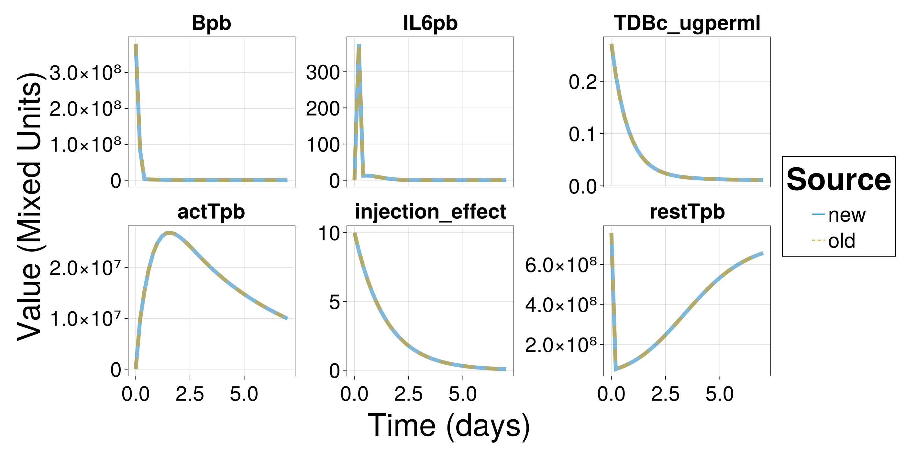 </td>
    <td> 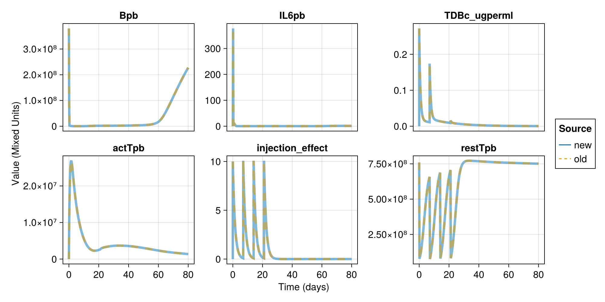 </td>
  </tr>
</table>

PK data for mosunentuzumab was obtained from [its label](https://www.accessdata.fda.gov/drugsatfda_docs/label/2022/761263s000lbl.pdf). The comparison (generated <a href = "mtk-cyno/hosseini-cyno-model-breakdown.jl">here</a>) is shown as below. 
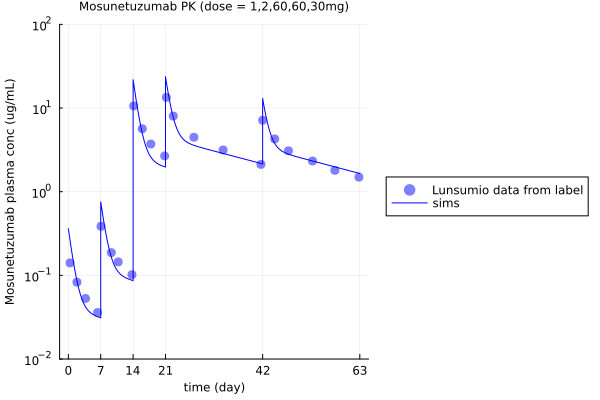

The **FINAL** cleaned up model is `tdb_homo.jl`. The parameters are all human parameters. If wishes to use the cyno version, the following parameters should be updated: 
1. PK-related parameters 
2. tissue volume (i.e. Vpb, Vtissue, Vtissue2, Vtissue3)
3. partition coefficient of T cells (i.e. KTrp, KTrp2, KTrp3)
4. partition coefficient of B cells (i.e. KBp, KBp2, KBp3)
5. IL6 production rate (kIL6prod)

 # Source code for original Hosseini model implementation 

| Script name | Description |
| -------- | ------- |
| `model/bs-lonca-3.jl` | TDB + ADC model copied from project ADC0601 (fully QCed) |
| `model/init.jl` | initialization for `model/bs-lonca-3.jl` (fully QCed) |
| `model/param.jl` | initialization for `model/bs-lonca-3.jl` (fully QCed) |
| `script/helper.jl` | pre-equilibrium helper function for `model/bs-lonca-3.jl` (fully QCed) |
| `script/param-scan-lonca.jl` | parameter scan for Lonca simulation using Latin hypercube (copied from project ADC0304f) |
| `script/param-scan-mosun-epco-label-dosing.jl` | parameter scan for mosunetuzumab/ epcoritmab/ glofitamab simulation using Latin hypercube (copied from project ADC0304f) |  
| `model/ParamUpdate.jl` | Parameter update for mosunetuzumab, glofitamab, epcoritamab (adopted from project ADC0601) |
| `script/dose-response-explore-epco.jl` | To explore dose-response in epcoritamab | 
| `script/dose-response-explore-lonca.jl` | To explore dose-response in Lonca | 
| `script/dose-response-explore-mosun.jl` | To explore dose-response in mosunetuzumab | 
| `script/dose-response-lonca.R` | Visualization of dose-response in Lonca population simulation | 
| `model/tdb_cyno.jl` | Implementation of Hosseini + ADC model in `ModelingToolkit` (human parameters) |
| `model/tdb_cyno_2.jl` | Implementation of Hosseini model in `ModelingToolkit` (human parameters) |
| `tdb_homo.jl` | Cleaned up version of `model/tdb_cyno_2.jl` (**FINAL MODEL**)|
| `script/pk_mosun.jl` | to run all models in `model/tdb_cyno_2.jl` and show mosunetuzumab PK profile matches what was published | 

## Simplification of Hosseini model

Simplification of the model was explored. Lymph node appeared to be too important to be removed from the model because it contributed to be big sink for T cells. Removing it results in overprediction of TDB's antitumor effect (Figure 2.2). 

 <em> Figure 2.2. Comparison when T cells were removed from lymph nodes (LN), bone marrow (BM), and spleen. Mosunetuzumab dosed at 1 mg at D0 </em> 

 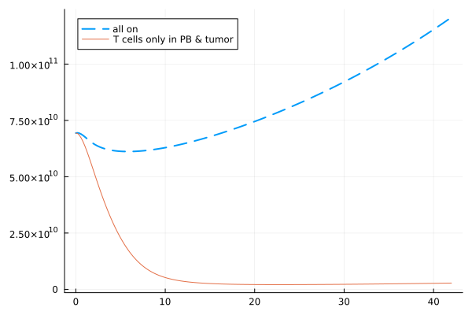 

However, removing T cells in spleen and bone marrow, and B cells in spleen (defined in `model/tdb_cyno_6.jl`) appeared to result in minor changes in tumor volume dynamics. The only significant change was observed in B cell in bone marrow, which is as expected. Below showing 2 different dosing schemes (Figure 2.3, 2.4) to illustrate the point. 

 <em> Figure 2.3. Comparison when T cells were removed from bone marrow (BM), and spleen, B cells were removed from spleen. Mosunetuzumab dosed at 1 mg at D0 </em> 

 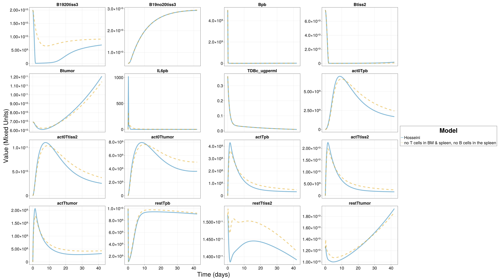 

 <em> Figure 2.4. Comparison when T cells were removed from bone marrow (BM), and spleen, B cells were removed from spleen. Mosunetuzumab dosed at 1 mg at D0, 2 mg at D7, 60 mg at D14, D21, 30 mg at 42 </em> 

 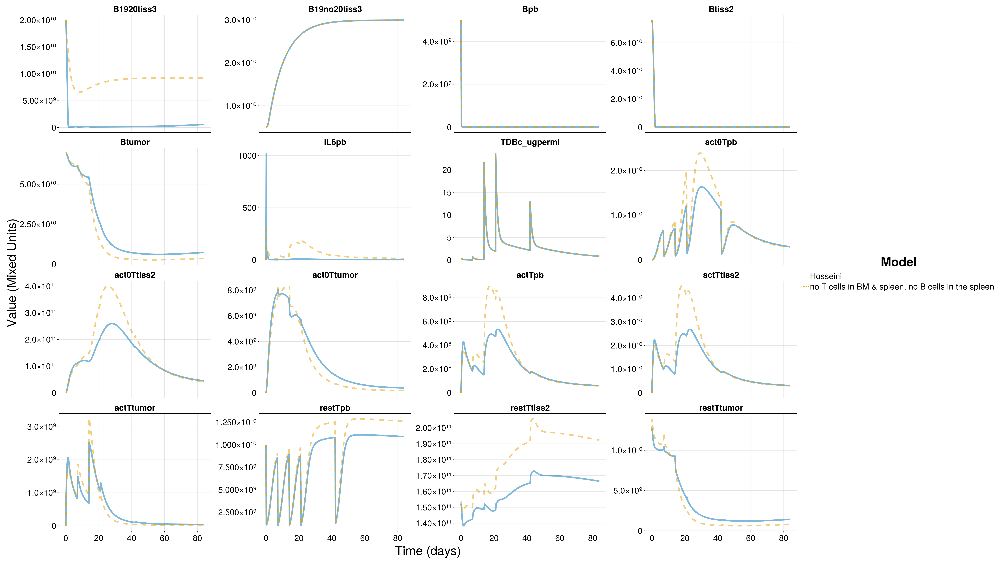 

All verions of simplification that has been explored related to Hosseini model can be found in Table 2.2. Not all results were discussed. 

 <em> Table 2.2. Description of scripts related to Hosseini model simplification. </em> 

| Script name | Description |
| -------- | ------- |
| `model/tdb_cyno_3.jl` |remove T cells other than in PB and in tumor (based on `model/tdb_cyno_2.jl`) |
| `model/tdb_cyno_4.jl` |remove T cells in spleen (based on `model/tdb_cyno_2.jl`) |
| `model/tdb_cyno_5.jl` |remove T cells in spleen & BM (based on `model/tdb_cyno_3.jl`) |
| `model/tdb_cyno_6.jl` |remove T cells in spleen & BM, remove B cells in spleen (based on `model/tdb_cyno_5.jl`) |
| `model/tdb_cyno_7.jl` |remove T cells in spleen & BM, remove B cells in spleen & lymph nodes (based on `model/tdb_cyno_6.jl`) |
| `model/tdb_cyno_8.jl` |remove T cells in spleen & BM, remove B cells in spleen, replace B cell output from bone marrow with steady state constant (based on `model/tdb_cyno_6.jl`) |
| `script/hosseini-tissue-test.jl` | to run all models in `model/tdb_cyno_2.jl` - `model/tdb_cyno_8.jl` | 

## IL6 comparison for the simplification model 

The original Hosseini model compared peak IL6 concentration after mosunetuzumab dosing. Here, the simplified model that removed T cells in spleen and bone marrow, and B cells in spleen (defined in `model/tdb_cyno_6.jl`). The prediction of plasma IL6 concentration is close to what was predicted in the original Hosseini model, and overall over-predicted the clinical observations (Figure 2.5). 

 <em> Figure 2.5. Comparison of peak plasma IL6 concentration when T cells were removed from bone marrow (BM), and spleen, B cells were removed from spleen. </em> 

 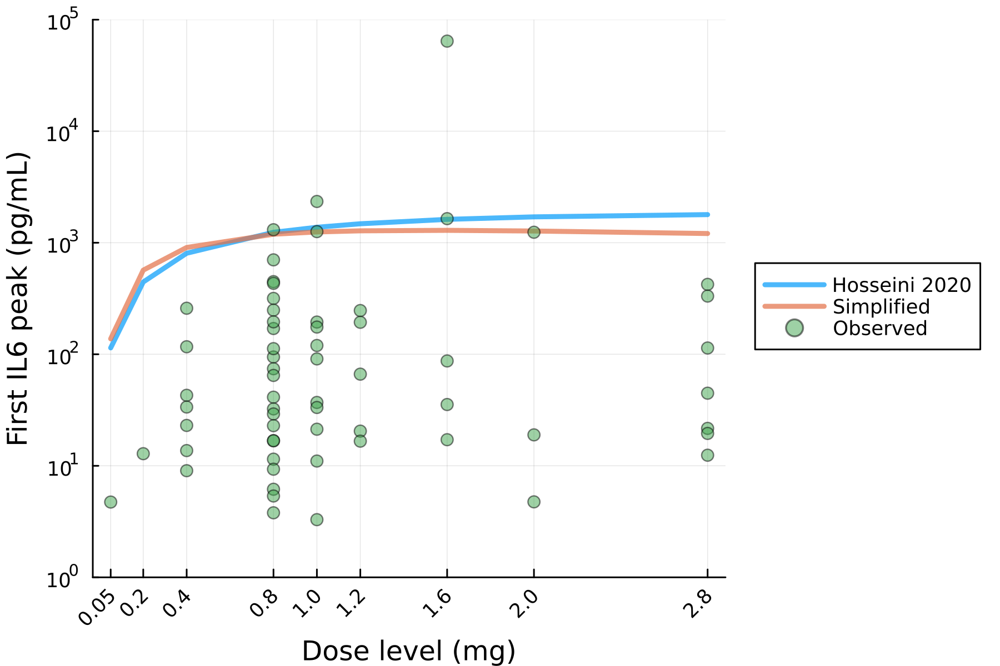  

Furthermore, sensitivity analysis reveals that, in the original Hosseini model, the initial peripheral blood B cell count was predicted to have a significant impact on the peak IL6 concentration (Figure 2.6B), while the impact from T cell count was less prominent (Figure 2.6A). The trend roughly holds in the simplified model (Figure 2.6C, Figure 2.6D), though the exact pattern changed slightly. Yet, the predicted range was still in the clinical observed range. 

<table>
    <tr> 
        <td> Figure 2.6A. Sensitivity analysis of IL6 when blood T cell count changes (original Hosseini model) </td> 
        <td> Figure 2.6B. Sensitivity analysis of IL6 when blood B cell count changes (original Hosseini model) </td> 
    </tr>
    <tr> 
        <td> 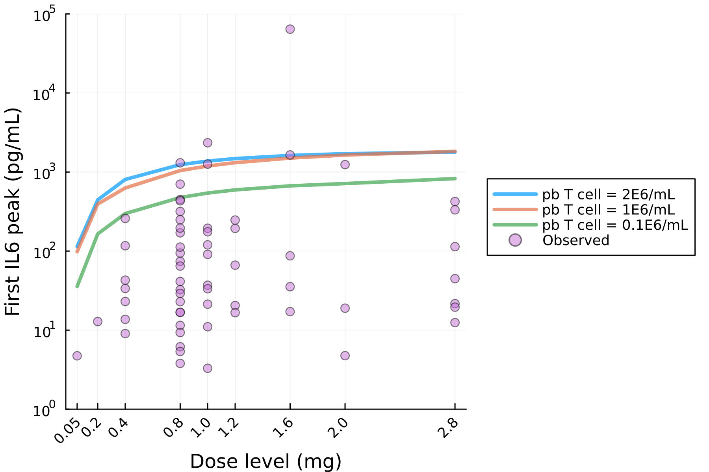 </td> 
        <td> 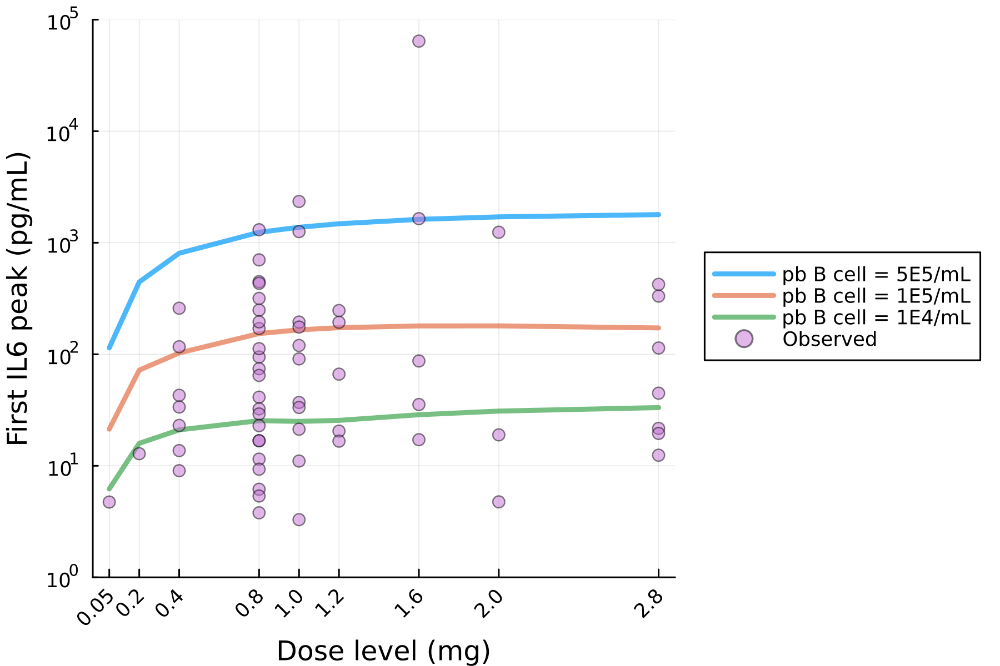 </td> 
    </tr>
    <tr> 
        <td> Figure 2.6C. Sensitivity analysis of IL6 when blood T cell count changes (simplified Hosseini model) </td> 
        <td> Figure 2.6D. Sensitivity analysis of IL6 when blood B cell count changes (simplified Hosseini model) </td> 
    </tr>
    <tr> 
        <td> 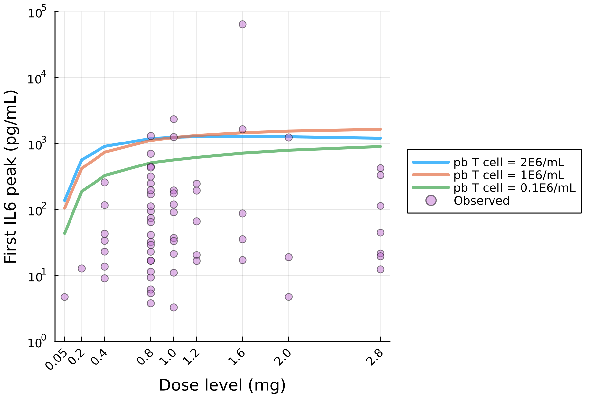 </td> 
        <td> 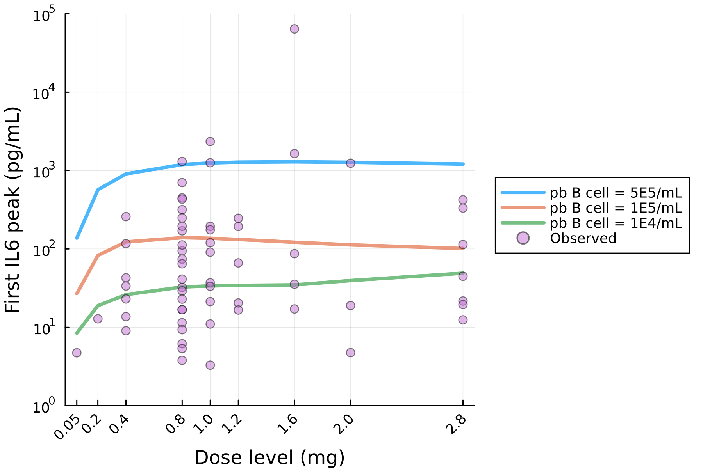 </td> 
    </tr>
</table>

Script that was used for IL6 related analysis was listed in Table 2.3. 

 <em> Table 2.3. Description of scripts related to Hosseini model simplification. </em> 

| Script name | Description |
| -------- | ------- |
| `script/hosseini-simplified-il6.jl` | to conduct IL6-related analysis on the original Hosseini model (defined in `model/tdb_cyno_2.jl`) and simplified model (defined in `model/tdb_cyno_6.jl`) |
