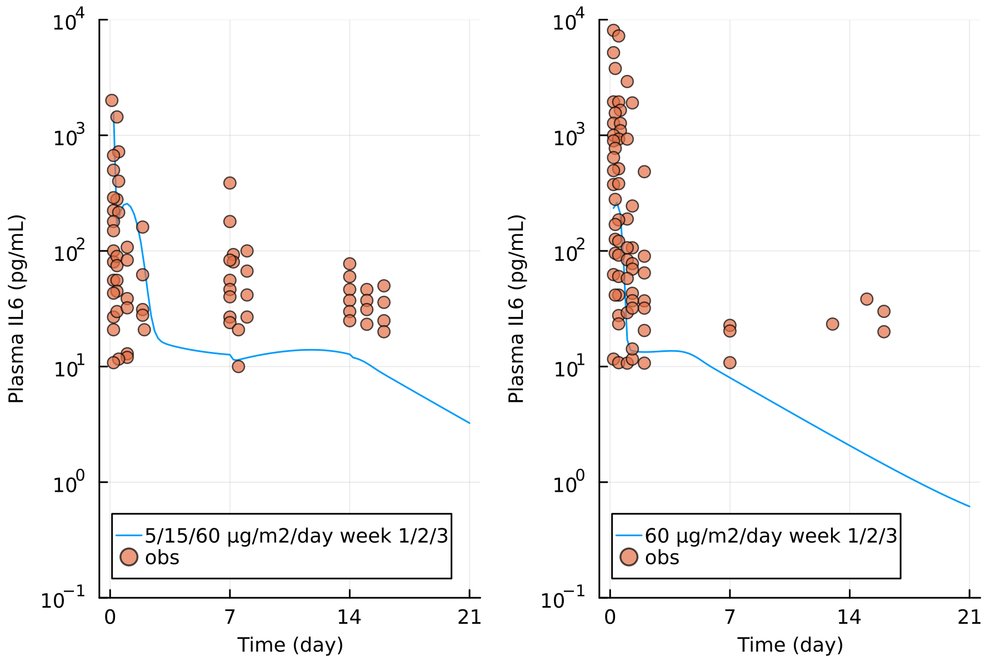
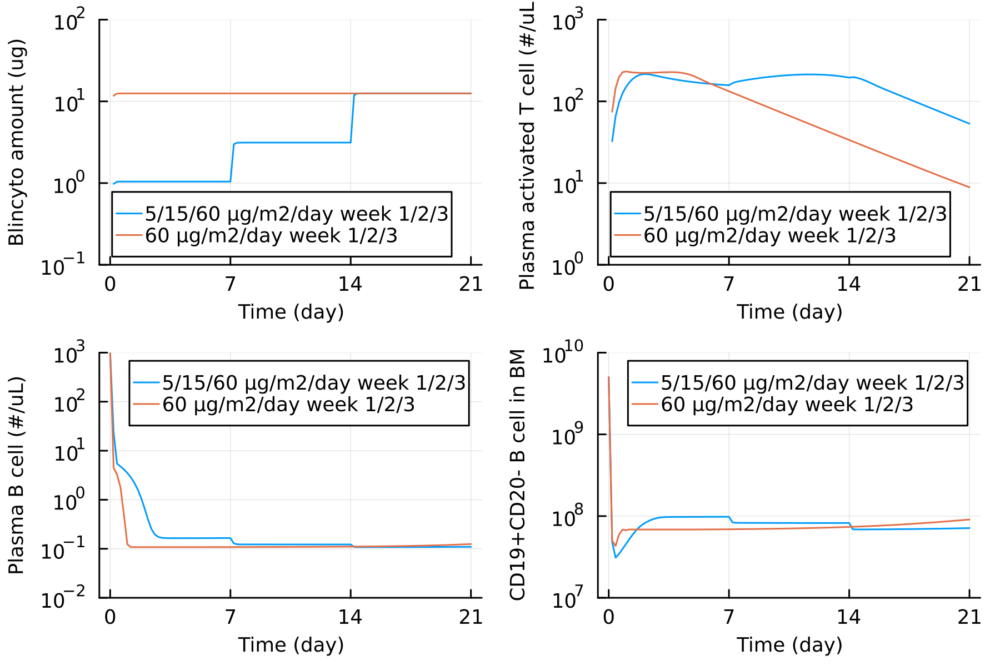

Implementation of blinatumomab model from Hosseini et al., 2020. 

The IL6 concentration simulated from the model was shown in Figure 1. The PK, plasma B cells and activated T cells are shown in Figure 2. 

After dosing up from 5 ug/m2/day to 15 ug/m2/day then to 60 ug/m2/day didn't yield peaks of IL6 as observed, presumably due to the B cell depletion in plasma, and less replenishment from the bone marrow. Potential increase in B cell progenitor proliferation may fix this issue. 

